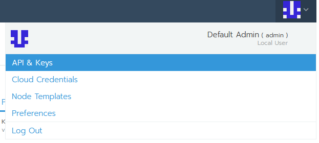
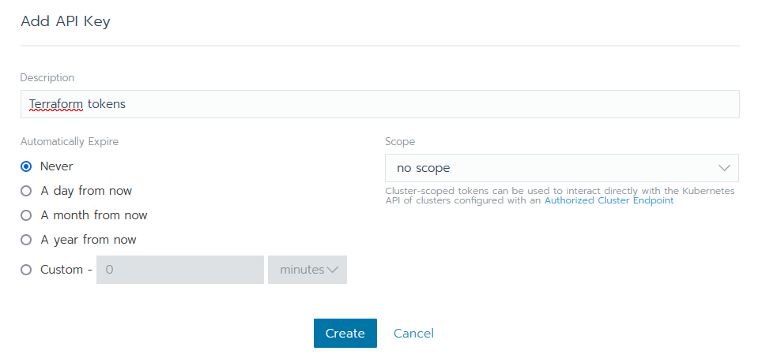
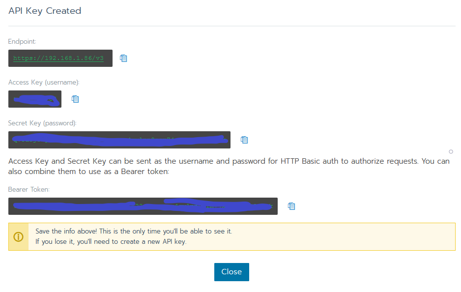

# Create access and secret tokens in Rancher

## Prerequisites

- an existing rancher server with admin user account

## Steps

First, log in through your rancher server URL.

Now you're logged in, click the user profile button in the upper right corner, and click `API & Keys` :

> Here you can manage the admin's tokens.

Click the `Add Key` button in order to create new tokens for the current admin account :

Here give a description to your new tokens, then click `Create` button :

Once created, you can see the keys and tokens that just have been created :

> Please, ensure to keep them in a safe location.
